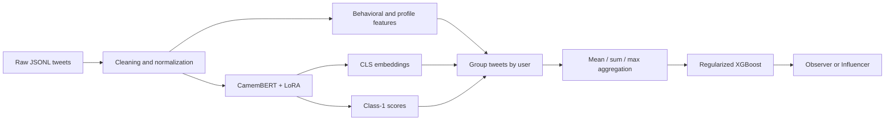
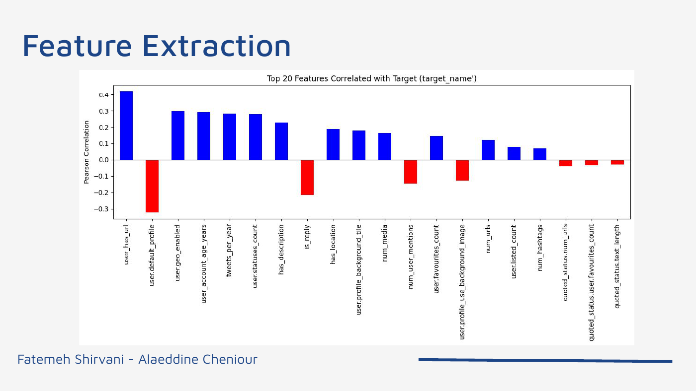
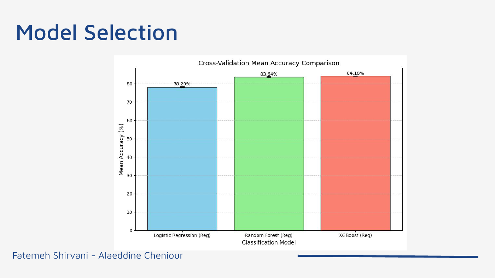
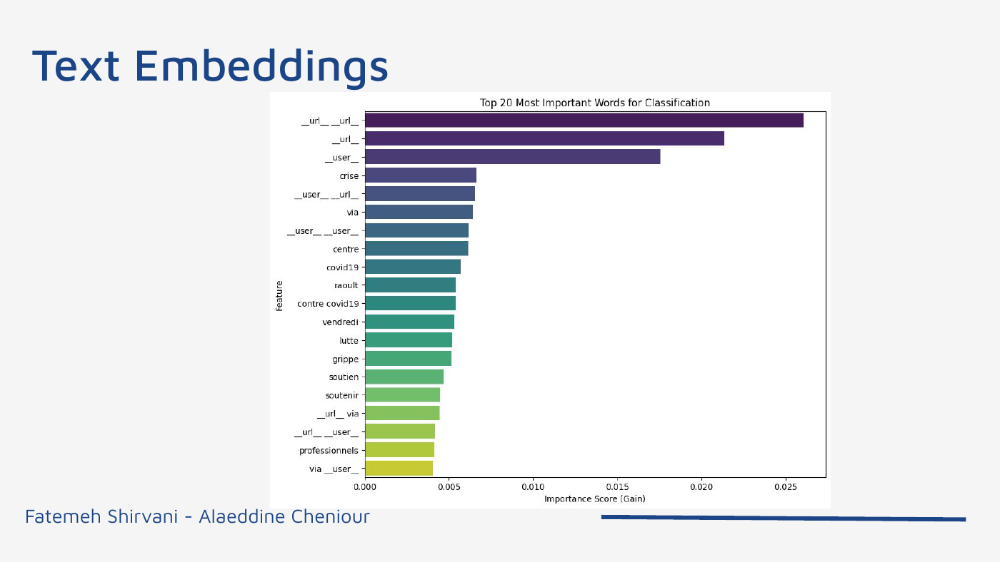
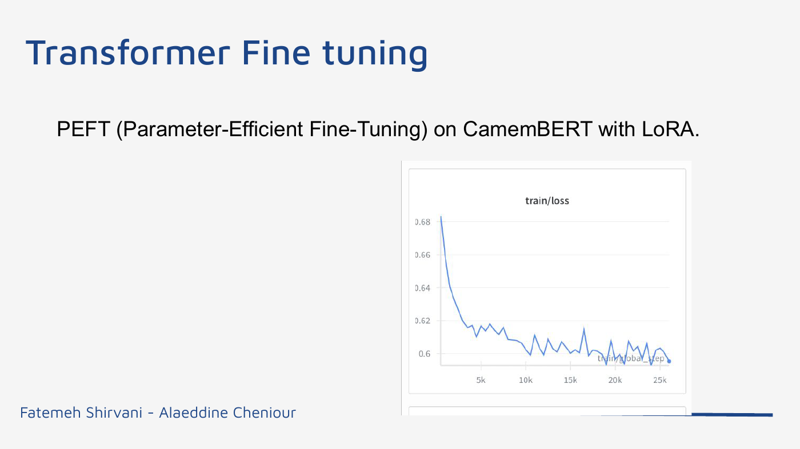
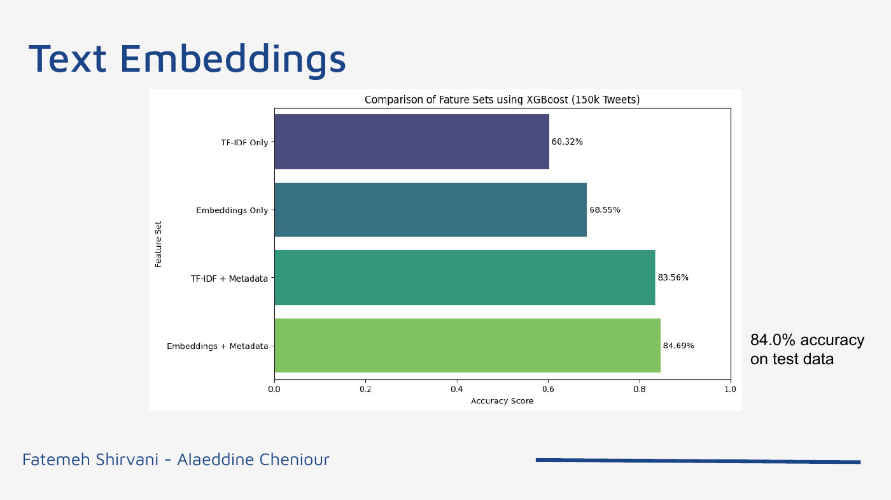
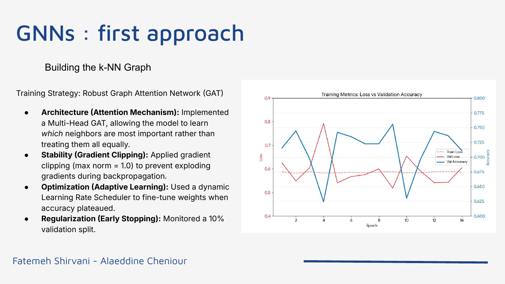

# Observer vs. Influencer: French Twitter User Classification

This project classifies French Twitter users as **observers** or **influencers**
from tweet content, profile metadata, and interaction signals. It was developed for
the CSC_51054_EP 2025 machine-learning challenge at Institut Polytechnique de Paris.

The final system combines a LoRA-fine-tuned CamemBERT model, engineered behavioral
features, user-level aggregation, and a regularized XGBoost classifier. It reached
**84.2% accuracy on the competition test set**.

## Why this problem is difficult

The source records are tweets, but the target describes the **person behind the
tweets**. A single user may appear in several rows, follower information can be
missing, and textual content alone is not a reliable measure of influence. The
solution therefore combines three views of each user:

- what they write: contextual CamemBERT embeddings;
- how they behave: activity, engagement, and profile metadata;
- how their tweets relate: quoted-user and graph-derived signals.

## Final pipeline



## 1. Data cleaning and preprocessing

The raw dataset is nested JSONL containing tweet text, user profiles, and quoted
tweet information. Preprocessing performs the following operations:

1. Flatten nested JSON fields into tabular columns.
2. Remove constant columns and duplicated records where appropriate.
3. Convert Boolean values to integers.
4. Fill missing numeric values with `0` and missing text with an empty string.
5. Normalize whitespace and replace URLs and mentions with `[URL]` and `[USER]`.
6. Preserve quoted-tweet fields for interaction and graph experiments.

## 2. Engineered metadata features

The model derives signals describing account maturity, posting behavior, profile
completion, and tweet structure. Important examples include:

| Feature group | Examples |
|---|---|
| Account | `user_account_age_years`, default-profile flag, URL presence, geo-enabled flag |
| Activity | `tweets_per_year`, status count, favorites per tweet |
| Content | text length, uppercase ratio, hashtag, mention, URL, and media counts |
| Quoted user | follower, friend, and status counts; quoted engagement score |

Profile URL presence, account age, geo-enabled status, and posting activity showed
the strongest positive relationships with the target. Default profiles and reply
behavior were negatively associated with the influencer class. Quoted-content
features were weaker than user-owned metadata.



## 3. Classical model baseline

Logistic regression, random forest, and XGBoost were compared on the engineered
tabular features. These experiments established that metadata alone is already a
strong signal and provided a baseline for evaluating the more complex text and
graph components.



The feature-importance analysis also confirmed that a small set of profile and
behavioral attributes contributes much more than most content-level counts.



## 4. CamemBERT and LoRA fine-tuning

`camembert-base` was adapted to the French tweet-classification task using LoRA
(Low-Rank Adaptation). LoRA updates a small set of trainable adapter parameters
instead of fine-tuning every transformer weight, reducing memory and training cost.

For every tweet, the transformer produces:

- a 768-dimensional final-layer `[CLS]` embedding;
- a probability score for the influencer class.

The embeddings capture semantic information that TF-IDF and metadata cannot express.
PCA and UMAP were also tested as dimensionality-reduction steps, but they did not
produce a meaningful improvement on the held-out data.



## 5. Combining text and metadata

Several feature combinations were tested: TF-IDF only, transformer embeddings only,
metadata only, and hybrid variants. Embeddings helped represent tweet meaning, but
their gains were modest when added directly at tweet level. The decisive improvement
came from matching the learning unit to the target and aggregating information at
the user level.



## 6. Graph experiments

Two graph strategies investigated whether influence could be recovered from network
position.

### Semantic k-nearest-neighbor graph

Each tweet was connected to its most similar tweets using cosine distance between
CamemBERT embeddings. A multi-head Graph Attention Network (GAT) used attention,
gradient clipping, learning-rate scheduling, and early stopping. The local
neighborhood signal became more stable as `k` increased:

| Neighbors (`k`) | 5 | 10 | 15 |
|---:|---:|---:|---:|
| Accuracy | 0.54 | 0.75 | 0.77 |

### Relationship graph

Tweets became nodes and edges represented shared authors, shared quoted users,
quotes of the same tweet, or replies to the same tweet. Two representations were
evaluated:

- random walks followed by 128-dimensional Word2Vec embeddings: **0.537 accuracy**;
- a three-stage Graph Convolutional Network: **0.539 accuracy**.



These graph features added noise rather than improving the final classifier. The
available relationships were inferred and incomplete, so they were less reliable
than direct user-level metadata.

## 7. User-level aggregation

The ground-truth label belongs to a user, not an individual tweet. Users were linked
by extracting an identifier from `profile_banner_url`; `challenge_id` was used as a
fallback for roughly 18% of users without that field.

For each user, the pipeline constructs one feature vector containing:

- the mean of all CamemBERT `[CLS]` embeddings;
- mean, sum, and maximum class-confidence scores;
- mean, sum, and maximum values of behavioral and profile features;
- the number of tweets as an exposure-strength signal.

Mean pooling smooths noisy individual tweets while the min/max/sum statistics retain
both typical and extreme behavior. A regularized XGBoost model is then trained on
these user rows.

Key XGBoost settings:

```python
XGBClassifier(
    objective="binary:logistic",
    eval_metric="logloss",
    n_estimators=1000,
    learning_rate=0.01,
    max_depth=6,
    colsample_bytree=0.5,
    tree_method="hist",
    random_state=42,
)
```

The low learning rate and column subsampling reduce overfitting in the dense hybrid
feature space.

## Results and conclusions

| Approach | Outcome |
|---|---:|
| Fine-tuned text embeddings alone | 84.0% test accuracy |
| Metadata + LoRA score + text embeddings | 84.2% test accuracy |
| Random-walk graph embeddings | 53.7% accuracy |
| Graph Convolutional Network | 53.9% accuracy |

The main lesson is that **representation granularity mattered more than model
complexity**. Graph models were attractive conceptually, but the inferred graph was
too noisy. Grouping tweets by user aligned the inputs with the target and produced a
more stable, interpretable solution.

## Repository structure

```text
assets/figures/       Technical figures used in this README
src/
  embedding.py       CamemBERT fine-tuning and embedding extraction
  baseline.py        Cleaning, aggregation, XGBoost, and submission generation
notebooks/
  embeddings.ipynb   Transformer and embedding experiments
  final-pipeline.ipynb
requirements.txt
```

The raw competition data, generated embeddings, model checkpoints, and submissions
are intentionally excluded because they are large, private, or reproducible outputs.

## Setup and execution

```bash
python -m venv .venv
# Windows: .venv\Scripts\activate
# macOS/Linux: source .venv/bin/activate
pip install -r requirements.txt
```

Place `train.jsonl` and `kaggle_test.jsonl` in the working directory, then run:

```bash
python src/embedding.py
python src/baseline.py
```

The transformer stage is GPU-intensive and was developed in Google Colab. Run the
embedding stage before the classifier so that the `.npy` features are available.

## Authors

Fatemeh Shirvani and Alaeddine Cheniour  
Institut Polytechnique de Paris
